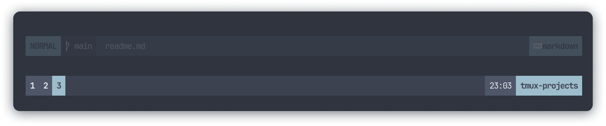

# ⚡ shifter
A minimalist, versatile and opinionated theme for tmux.

<p>

</p>

## Features
- Opinionated UI with sane defaults 💡
- Support for popular themes like `nord` and `poimandres` 🎨
> Check the list of supported themes [here](/#supported-themes).

## Installing
Using [tpm](https://github.com/tmux-plugins/tpm), add this to your `tmux.conf`
```sh
set -g @plugin 'bettervim/shifter'
set -g @shifter_theme 'nord'
```

## Supported themes
- [x] `nord`
- [x] `everforest`
- [x] `poimandres`
- [x] `catppuccin`

Work in progress, will be released soon ⚙️
- [ ] `ayu`
- [ ] `dracula`
- [ ] `tokyonight`

## License
MIT
